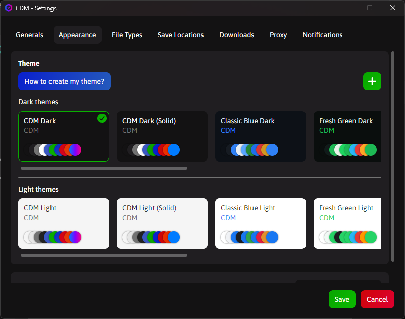

# CDM Theme Customization Guide

## 🎨 Custom Themes

**Cross Platform Download Manager (CDM)** supports custom themes that allow you to personalize the application's appearance according to your preferences. You can either use the built-in themes or create your own from scratch.

## Available Themes

CDM comes with several built-in themes that you can use as a starting point for your own custom themes:

1. **CDM Dark** – Ideal for low-light environments with gradient effects.
2. **CDM Light** – Optimized for bright environments with gradient effects.
3. **CDM Dark (Solid)** – Dark theme that uses only solid colors.
4. **CDM Light (Solid)** – Light theme that uses only solid colors.
5. **Classic Blue Dark** – Dark theme with a classic blue accent and solid colors.
6. **Classic Blue Light** – Light theme with a classic blue accent and solid colors.
7. **Fresh Green Dark** – Dark theme with a fresh green accent and solid colors.
8. **Fresh Green Light** – Light theme with a fresh green accent and solid colors.
9. **Golder Luxury Dark** – Dark theme with a golden luxury accent and gradient colors.
10. **Golder Luxury Light** – Light theme with a golden luxury accent and gradient colors.
11. **Modern Violet Dark** – Dark theme with a modern violet accent and solid colors.
12. **Modern Violet Light** – Light theme with a modern violet accent and solid colors.
13. **Ocean Teal Dark** – Dark theme with an ocean teal accent and solid colors.
14. **Ocean Teal Light** – Light theme with an ocean teal accent and solid colors.
15. **Sunset Warm Dark** – Dark theme with warm sunset tones and solid colors.
16. **Sunset Warm Light** – Light theme with warm sunset tones and solid colors.

You can download these theme files from the [Themes folder on GitHub](https://github.com/adel-bakhshi/CrossPlatformDownloadManager/tree/master/CrossPlatformDownloadManager.DesktopApp/Assets/Themes).

---

## 🛠 Creating Custom Themes

### Theme File Structure

CDM themes are JSON files with the following structure:

```json
{
  "name": "Your Theme Name",
  "author": "Your Name",
  "isDarkTheme": true,
  "mainBackgroundColor": {
    "brushMode": 0,
    "color": "#HEXCODE",
    "opacity": 1
  }
}
```

### Theme Metadata Properties

| Property      | Type    | Description                                      |
| ------------- | ------- | ------------------------------------------------ |
| `name`        | string  | The display name of your theme                   |
| `author`      | string  | Theme creator's name                             |
| `isDarkTheme` | boolean | `true` for dark themes, `false` for light themes |

### Brush Modes

CDM supports two types of color rendering:

- **BrushMode 0 (Solid)**: Single solid color

  ```json
  {
    "brushMode": 0,
    "color": "#FFFFFF",
    "opacity": 1
  }
  ```

- **BrushMode 1 (Gradient)**: Linear gradient with multiple color stops
  ```json
  {
    "brushMode": 1,
    "startPoint": "0,0.5",
    "endPoint": "1,0.5",
    "gradientStops": [
      {
        "offset": 0,
        "color": {
          "brushMode": 0,
          "color": "#007BFF",
          "opacity": 1
        }
      },
      {
        "offset": 1,
        "color": {
          "brushMode": 0,
          "color": "#FF007F",
          "opacity": 1
        }
      }
    ]
  }
  ```

---

## 🎨 Color Properties Reference

### Background Colors

| Property                   | Description                                          |
| -------------------------- | ---------------------------------------------------- |
| `mainBackgroundColor`      | Main background color of the application             |
| `secondaryBackgroundColor` | Secondary background color used for panels and cards |
| `menuBackgroundColor`      | Background color of menus                            |
| `menuItemHoverColor`       | Background color when hovering over menu items       |

### Text Colors

| Property           | Description                                   |
| ------------------ | --------------------------------------------- |
| `mainTextColor`    | Primary text color throughout the application |
| `buttonTextColor`  | Text color for buttons                        |
| `dialogTextColor`  | Text color for dialog windows                 |
| `managerTextColor` | Text color used in the manager                |

### Accent and Interactive Colors

| Property      | Description                                               |
| ------------- | --------------------------------------------------------- |
| `accentColor` | Accent color for UI elements                              |
| `mainColor`   | Primary brand color, used for logo and manager background |
| `iconColor`   | Color for icons throughout the application                |
| `linkColor`   | Color for clickable links                                 |

### Category Tree View

| Property                      | Description                                                                                |
| ----------------------------- | ------------------------------------------------------------------------------------------ |
| `categoryHeaderHoverColor`    | Text color when hovering over category headers or sub-headers in the filter TreeView       |
| `categoryHeaderSelectedColor` | Text color for selected category headers or sub-headers (e.g., All, Completed, Incomplete) |

### Proxy Settings

| Property             | Description                                               |
| -------------------- | --------------------------------------------------------- |
| `selectedProxyColor` | Border color for the active proxy in Settings → Proxy tab |

### Toggle Switch

| Property             | Description                                      |
| -------------------- | ------------------------------------------------ |
| `toggleColor`        | Background color of toggle switch when unchecked |
| `toggleCheckedColor` | Background color of toggle switch when checked   |
| `toggleCircleColor`  | Color of the toggle switch circle/thumb          |

### Download Progress

| Property                       | Description                                                                |
| ------------------------------ | -------------------------------------------------------------------------- |
| `chunkProgressColor`           | Color of each chunk rectangle during download progress                     |
| `chunkProgressBackgroundColor` | Background canvas color behind the chunk progress bars                     |
| `gridRowColor`                 | Row highlight color when hovering over download items in the main DataGrid |
| `loadingIndicatorColor`        | Color of loading/progress indicators                                       |

### Status Colors

| Property       | Description                                    |
| -------------- | ---------------------------------------------- |
| `successColor` | Color for success messages and states          |
| `infoColor`    | Color for informational messages               |
| `warningColor` | Color for warning messages                     |
| `dangerColor`  | Color for error messages and dangerous actions |

### Dialog Buttons

| Property                      | Description                                      |
| ----------------------------- | ------------------------------------------------ |
| `dialogOkBackgroundColor`     | Background color for "OK" buttons in dialogs     |
| `dialogYesBackgroundColor`    | Background color for "Yes" buttons in dialogs    |
| `dialogNoBackgroundColor`     | Background color for "No" buttons in dialogs     |
| `dialogCancelBackgroundColor` | Background color for "Cancel" buttons in dialogs |

---

## 📝 Steps to Create a Custom Theme

1. **Download an existing theme** (preferably one closest to your desired look)
2. **Open the file with a text editor** (VS Code, Notepad++, etc.)
3. **Edit theme metadata**:
   - Change `name` to your theme name
   - Change `author` to your name
   - Set `isDarkTheme` to `true` or `false`
4. **Modify color values**:
   - Each color uses HEX code (e.g., `#FFFFFF` for white)
   - You can use tools like [Adobe Color](https://color.adobe.com/) to create color palettes
   - Decide whether to use solid colors (`brushMode: 0`) or gradients (`brushMode: 1`)
5. **Save the file** with `.json` extension

### Example: Converting Solid to Gradient

**Solid Color:**

```json
"mainColor": {
  "brushMode": 0,
  "color": "#007BFF",
  "opacity": 1
}
```

**Gradient Color:**

```json
"mainColor": {
  "brushMode": 1,
  "startPoint": "0,0.5",
  "endPoint": "1,0.5",
  "gradientStops": [
    {
      "offset": 0,
      "color": {
        "brushMode": 0,
        "color": "#007BFF",
        "opacity": 1
      }
    },
    {
      "offset": 0.5,
      "color": {
        "brushMode": 0,
        "color": "#8000FF",
        "opacity": 1
      }
    },
    {
      "offset": 1,
      "color": {
        "brushMode": 0,
        "color": "#FF007F",
        "opacity": 1
      }
    }
  ]
}
```

---

## 📂 Installing and Using Custom Themes

Follow these steps to add and apply your custom theme:

1. **Prepare your theme file**:

   - Make sure your theme file is ready and saved with the `.json` extension

2. **Open Settings**:

   - Launch CDM and go to:  
     **Settings → Appearance**  
       
     _Theme selection interface in Settings_

3. **Add your theme**:

   - Click the **Plus (+)** button
   - Select your theme JSON file from the file browser
   - The theme will automatically be added to the themes

4. **Apply your theme**:
   - Select your new theme from the dark or light themes
   - Save settings
   - The changes will apply immediately

> **Tip**: You can switch between themes anytime from this menu. The application remembers your last selected theme.

---

## 💡 Design Tips

### For Dark Themes

- Use dark background colors (e.g., `#131213`, `#201E21`)
- Use light text colors (e.g., `#FFFFFF`, `#CCCCCC`)
- Set `isDarkTheme` to `true`
- Ensure sufficient contrast for readability

### For Light Themes

- Use light background colors (e.g., `#F5F5F5`, `#E6E6E6`)
- Use dark text colors (e.g., `#222222`, `#333333`)
- Set `isDarkTheme` to `false`
- Avoid pure white backgrounds to reduce eye strain

### Gradient Tips

- Use `startPoint` and `endPoint` to control gradient direction:
  - Horizontal: `"0,0.5"` to `"1,0.5"`
  - Vertical: `"0.5,0"` to `"0.5,1"`
  - Diagonal: `"0,0"` to `"1,1"`
- Use 2-3 gradient stops for smooth transitions
- Maintain color harmony within gradients

### Opacity

- Control element transparency by adjusting the `opacity` value (range: 0 to 1)
- Use semi-transparent colors for overlays and hover effects
- Keep text opacity at 1 for maximum readability

### Color Harmony

- Maintain proper contrast between text and backgrounds
- Use consistent color families throughout the theme
- Test your theme in different lighting conditions
- Consider accessibility guidelines for color-blind users

---

## 🤝 Sharing Your Themes

If you've created an interesting theme, share it with the CDM community:

1. Create a new Issue on our [GitHub page](https://github.com/adel-bakhshi/CrossPlatformDownloadManager/issues)
2. Attach your theme file
3. Describe your theme's features and best use cases
4. Include screenshots if possible

We may include outstanding themes in the official CDM collection!

---

## 📋 Complete Theme Template

```json
{
  "name": "My Custom Theme",
  "author": "Your Name",
  "isDarkTheme": false,
  "mainBackgroundColor": {
    "brushMode": 0,
    "color": "#F5F5F5",
    "opacity": 1
  },
  "secondaryBackgroundColor": {
    "brushMode": 0,
    "color": "#E6E6E6",
    "opacity": 1
  },
  "accentColor": {
    "brushMode": 0,
    "color": "#727272",
    "opacity": 1
  },
  "mainTextColor": {
    "brushMode": 0,
    "color": "#222222",
    "opacity": 1
  },
  "buttonTextColor": {
    "brushMode": 0,
    "color": "#FFFFFF",
    "opacity": 1
  },
  "categoryHeaderHoverColor": {
    "brushMode": 0,
    "color": "#41BAA8",
    "opacity": 1
  },
  "categoryHeaderSelectedColor": {
    "brushMode": 0,
    "color": "#41BAA8",
    "opacity": 1
  },
  "menuBackgroundColor": {
    "brushMode": 0,
    "color": "#DCDCDC",
    "opacity": 1
  },
  "menuItemHoverColor": {
    "brushMode": 0,
    "color": "#BFBFBF",
    "opacity": 1
  },
  "iconColor": {
    "brushMode": 0,
    "color": "#3A58C2",
    "opacity": 1
  },
  "selectedProxyColor": {
    "brushMode": 0,
    "color": "#EBEBEB",
    "opacity": 1
  },
  "toggleCircleColor": {
    "brushMode": 0,
    "color": "#FFFFFF",
    "opacity": 1
  },
  "toggleColor": {
    "brushMode": 0,
    "color": "#727272",
    "opacity": 1
  },
  "toggleCheckedColor": {
    "brushMode": 0,
    "color": "#007BFF",
    "opacity": 1
  },
  "loadingIndicatorColor": {
    "brushMode": 0,
    "color": "#980C0C",
    "opacity": 1
  },
  "dialogTextColor": {
    "brushMode": 0,
    "color": "#FFFFFF",
    "opacity": 1
  },
  "dialogOkBackgroundColor": {
    "brushMode": 0,
    "color": "#3549C5",
    "opacity": 1
  },
  "dialogYesBackgroundColor": {
    "brushMode": 0,
    "color": "#10BA18",
    "opacity": 1
  },
  "dialogNoBackgroundColor": {
    "brushMode": 0,
    "color": "#F44336",
    "opacity": 1
  },
  "dialogCancelBackgroundColor": {
    "brushMode": 0,
    "color": "#FF9800",
    "opacity": 1
  },
  "managerTextColor": {
    "brushMode": 0,
    "color": "#FFFFFF",
    "opacity": 1
  },
  "mainColor": {
    "brushMode": 0,
    "color": "#007BFF",
    "opacity": 1
  },
  "successColor": {
    "brushMode": 0,
    "color": "#09A500",
    "opacity": 1
  },
  "infoColor": {
    "brushMode": 0,
    "color": "#0A20CC",
    "opacity": 1
  },
  "dangerColor": {
    "brushMode": 0,
    "color": "#CF0509",
    "opacity": 1
  },
  "warningColor": {
    "brushMode": 0,
    "color": "#EA2F00",
    "opacity": 1
  },
  "chunkProgressColor": {
    "brushMode": 0,
    "color": "#09A500",
    "opacity": 1
  },
  "chunkProgressBackgroundColor": {
    "brushMode": 0,
    "color": "#BFBFBF",
    "opacity": 1
  },
  "gridRowColor": {
    "brushMode": 0,
    "color": "#DC97FF",
    "opacity": 1
  },
  "linkColor": {
    "brushMode": 0,
    "color": "#25E6C9",
    "opacity": 1
  }
}
```
