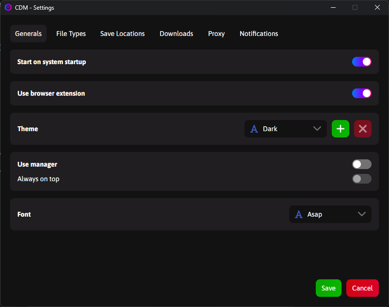

# CDM Theme Customization Guide

## 🎨 Custom Themes

**Cross Platform Download Manager (CDM)** supports custom themes that allow you to personalize the application's appearance according to your preferences. You can either use the built-in themes or create your own from scratch.

### Available Themes

We provide two default themes:

1. **Dark Theme** - Ideal for low-light environments
2. **Light Theme** - Optimized for bright environments

You can download these theme files from the [Themes folder on GitHub](https://github.com/adel-bakhshi/CrossPlatformDownloadManager/tree/master/CrossPlatformDownloadManager.DesktopApp/Assets/Themes).

---

## 🛠 Creating Custom Themes

### Theme File Structure

CDM themes are JSON files with the following structure:

```json
{
  "themeName": "YourThemeName",
  "isDarkTheme": true/false,
  "primaryColor": {
    "brushMode": 0,
    "color": "#HEXCODE",
    "opacity": 1
  },
  // Other color settings...
}
```

### Steps to Create a Custom Theme:

1. **Download an existing theme** (preferably one closest to your desired look)
2. **Open the file with a text editor** (VS Code, Notepad++, etc.)
3. **Modify the color values**:
   - Each color uses HEX code (e.g., `#FFFFFF` for white)
   - You can use tools like [Adobe Color](https://color.adobe.com/) to create color palettes
4. **Change the theme name** (edit the `themeName` field)
5. **Save the file** (with `.json` extension)

### Example Color Modification:

To change the primary color, edit this section:

```json
"primaryColor": {
  "brushMode": 0,
  "color": "#131213",  // Change this value
  "opacity": 1
}
```

---

## 📂 Installing and Using Custom Themes

Follow these steps to add and apply your custom theme:

1. **Prepare your theme file**:

   - Make sure your theme file is ready and saved with the .json extension

2. **Open Settings**:

   - Launch CDM and go to:  
     **Settings → General**  
       
     _Theme selection interface in Settings_

3. **Add your theme**:

   - Click the **Plus (+)** button
   - Select your theme JSON file from the file browser
   - The theme will automatically be added to the selection list

4. **Apply your theme**:
   - Select your new theme from the dropdown menu
   - The changes will apply immediately

> **Tip**: You can switch between themes anytime from this menu. The application remembers your last selected theme.

---

## 🎨 Advanced Customization

CDM themes support these advanced features:

### Gradients

You can create gradient effects for certain elements:

```json
"primaryGradientBrush": {
  "brushMode": 1,
  "startPoint": "0,0.5",
  "endPoint": "1,0.5",
  "gradientStops": [
    {
      "offset": 0,
      "color": {
        "brushMode": 0,
        "color": "#007BFF",
        "opacity": 1
      }
    },
    // Additional gradient points...
  ]
}
```

### Opacity

Control element transparency by adjusting the `opacity` value (range: 0 to 1).

---

## 💡 Design Tips

1. **For Dark Themes**:

   - Use dark background colors
   - Use light text colors
   - Set `isDarkTheme` to `true`

2. **For Light Themes**:

   - Use light background colors
   - Use dark text colors
   - Set `isDarkTheme` to `false`

3. **Maintain proper contrast** between text and backgrounds for readability

---

## 🤝 Sharing Your Themes

If you've created an interesting theme, share it with the CDM community:

1. Create a new Issue on our [GitHub page](https://github.com/adel-bakhshi/CrossPlatformDownloadManager/issues)
2. Attach your theme file
3. Describe your theme's features and best use cases

We may include outstanding themes in the official CDM collection!
