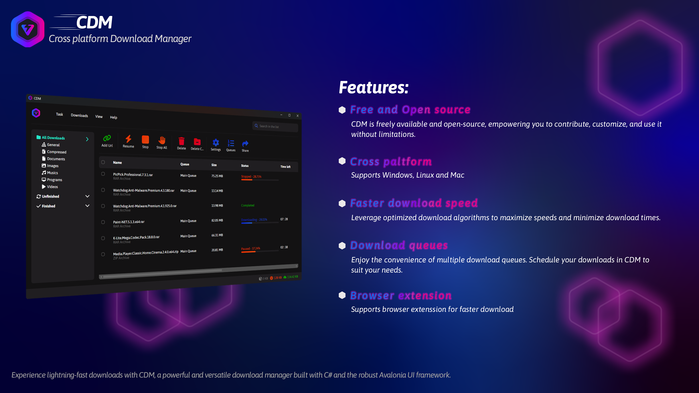
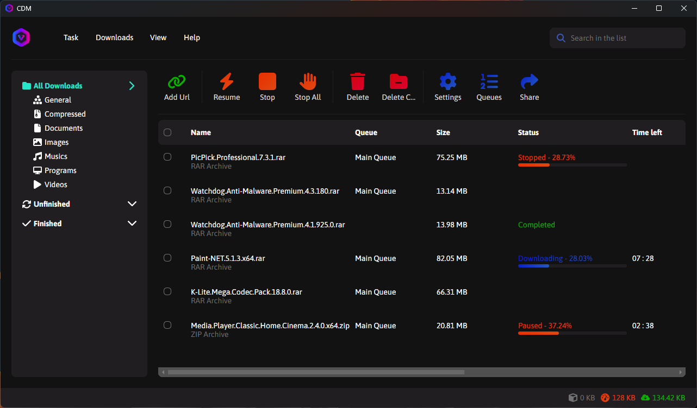
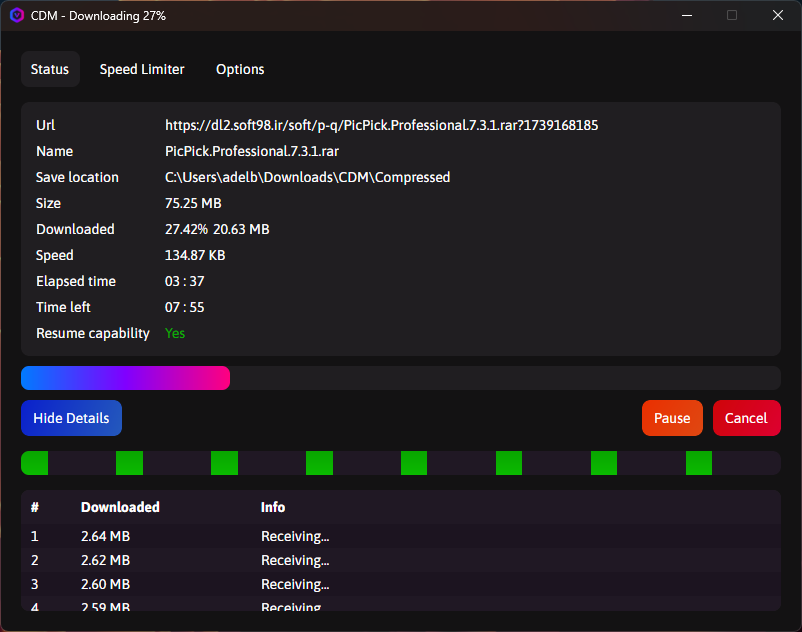
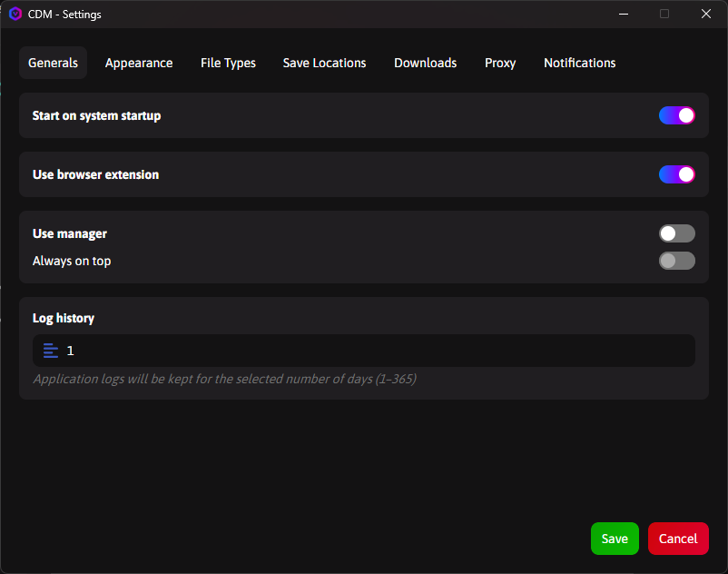

# 🌐 Gestor de Descargas Multiplataforma (CDM)

---

---

## Acerca de CDM

**Gestor de Descargas Multiplataforma (CDM)** es un **gestor de descargas rápido, gratuito y de código abierto** diseñado para ofrecer una experiencia de descarga fluida en múltiples sistemas operativos.

### Eslogan:

_"Un gestor de descargas rápido, gratuito y de código abierto para Windows, macOS y Linux."_

---

## 📦 Compilado y Empaquetado con Netloy

**CDM** aprovecha el poder de **[Netloy](https://github.com/adel-bakhshi/Netloy)** — una herramienta de empaquetado y despliegue .NET multiplataforma de vanguardia — para ofrecer instaladores profesionales en las plataformas Windows, Linux y macOS sin complicaciones.

### ¿Por qué Netloy?

Netloy elimina la complejidad de crear paquetes específicos de cada plataforma al automatizar toda la cadena de compilación y despliegue. Con un solo archivo de configuración, CDM genera:

- **Windows:** Instaladores MSI y EXE (WiX v3 e Inno Setup)
- **Linux:** Paquetes DEB, RPM, AppImage, Flatpak y Pacman
- **macOS:** Paquetes APP e instaladores DMG
- **Portable:** Archivos ZIP/TAR.GZ multiplataforma

### Integración Automatizada de CI/CD

El proceso de lanzamiento de CDM está completamente automatizado mediante **GitHub Actions** y Netloy. Cada lanzamiento automatiza:

- Compila la aplicación para todas las plataformas objetivo
- Genera instaladores específicos de cada plataforma con los metadatos e iconos adecuados
- Crea archivos de integración de escritorio y metadatos de AppStream
- Publica los artefactos del lanzamiento en GitHub Releases

Esta automatización garantiza lanzamientos consistentes y fiables en todas las plataformas sin intervención manual. ¡Consulte nuestro [flujo de trabajo de CI/CD](https://github.com/adel-bakhshi/CrossPlatformDownloadManager/blob/master/.github/workflows/dotnet-desktop.yml) para ver Netloy en acción!

### ¿Desea Simplificar el Despliegue de su Aplicación .NET?

Si está desarrollando aplicaciones .NET multiplataforma y enfrenta dificultades con requisitos de empaquetado complejos, **[Netloy](https://github.com/adel-bakhshi/Netloy)** puede ayudarle a lograr el mismo nivel de automatización y profesionalismo. ¡Diga adiós a los scripts de compilación manuales y a los dolores de cabeza específicos de cada plataforma!

---

## 📸 Capturas de Pantalla

A continuación, se muestran algunas capturas de pantalla que destacan las principales características de CDM:

<table class="table">
  <thead>
    <tr>
      <th scope="col" width="1000px">Interfaz Principal</th>
      <th scope="col" width="1000px">Descarga</th>
      <th scope="col" width="1000px">Configuración</th>
    </tr>
  </thead>
  <tbody>
    <tr>
      <td>
        
      </td>
      <td>
        
      </td>
      <td>
        
      </td>
    </tr>
  </tbody>
</table>

---

## 📥 Instalación

¡Empezar con **Gestor de Descargas Multiplataforma (CDM)** es sencillo! Siga estos pasos para instalar tanto la aplicación principal como la extensión del navegador.

### **1. Instalar la Aplicación Principal**

1. Visite la [Página de Lanzamientos](https://github.com/adel-bakhshi/CrossPlatformDownloadManager/releases).
2. Descargue la última versión de CDM para su sistema operativo (Windows, macOS o Linux).
3. Ejecute el instalador o extraiga los archivos (según su plataforma).
4. Inicie el programa y comience a gestionar sus descargas.

¡Eso es todo! No se requieren prerequisitos adicionales ni configuración extra.

### **2. Instalar la Extensión del Navegador**

Dado que no hemos podido publicar la extensión del navegador en la Chrome Web Store debido a un embargo, puede instalarla manualmente siguiendo estos pasos:

#### **Para Google Chrome y Otros Navegadores Basados en Chromium:**

1. **Descargue la Extensión:** Visite la [Página de Lanzamientos de la Extensión](https://github.com/adel-bakhshi/cdm-browser-extension/releases) y descargue el archivo `.crx` más reciente.
2. **Abra la Configuración de Extensiones:** En su navegador, vaya a `chrome://extensions/` en la barra de direcciones.

3. **Habilite el Modo Desarrollador:** Active el interruptor de **Modo Desarrollador** ubicado en la esquina superior derecha de la página.

4. **Instale la Extensión:**

   - Arrastre y suelte el archivo `.crx` descargado directamente en la página de extensiones.
   - Alternativamente, si tiene una carpeta sin empaquetar que contenga los archivos de la extensión, haga clic en **Cargar desempaquetado** y seleccione la carpeta.

5. **¡Listo!** La extensión ya estará instalada y lista para usar en su navegador basado en Chromium.

> **Nota:** Aunque este método funciona para la mayoría de los navegadores basados en Chromium (p. ej., Microsoft Edge, Brave, Vivaldi, Opera), algunos pueden tener configuraciones o interfaces ligeramente diferentes. Si encuentra algún problema, consulte la documentación de su navegador o infórmenos [reportando el problema](https://github.com/adel-bakhshi/cdm-browser-extension/issues).

#### **Para Firefox:**

1. **Descargue la Extensión:**  
   Visite la [página oficial de complementos de Mozilla](https://addons.mozilla.org/en-US/firefox/addon/cdm-browser-extension/) y haga clic en el botón **Agregar a Firefox**.

2. **Instale la Extensión:**  
   Después de hacer clic en **Agregar a Firefox**, siga las instrucciones para completar la instalación. Una vez instalada, la extensión aparecerá en su lista de complementos.

3. **¡Listo!** La extensión ya estará instalada y lista para usar en Firefox.

> **Nota:** La extensión para Firefox tiene soporte completo y se mantiene en el mismo proyecto de GitHub que la extensión basada en Chromium: [Enlace al proyecto en GitHub](https://github.com/adel-bakhshi/cdm-browser-extension). Las actualizaciones de los lanzamientos están sincronizadas en ambas plataformas.

---

### Notas Adicionales:

- Tanto la extensión basada en Chromium como la de Firefox se construyen y mantienen en el mismo proyecto de GitHub. Esto garantiza una funcionalidad y actualizaciones consistentes en todos los navegadores compatibles.
- Si encuentra algún problema durante la instalación o el uso, por favor [reporte el problema](https://github.com/adel-bakhshi/cdm-browser-extension/issues) para que podamos asistirle.

---

## 🎨 Temas Personalizados

CDM admite temas personalizados para personalizar su experiencia. Puede:

- Usar los temas oscuro/claro integrados
- Crear sus propios temas personalizados
- Compartir temas con la comunidad

Para instrucciones detalladas sobre cómo crear y aplicar temas personalizados, consulte nuestra [Guía de Personalización de Temas](./Assets/MarkDown/THEME_GUIDE.md).

## ✨ Características y Mejoras

**Gestor de Descargas Multiplataforma (CDM)** está lleno de funciones potentes diseñadas para mejorar su experiencia de descarga:

- **Gratuito y de Código Abierto:** Úselo sin restricciones y contribuya a su desarrollo bajo la licencia AGPL-3.
- **Soporte Multiplataforma:** Funciona sin problemas en Windows, macOS y Linux.
- **Velocidades de Descarga Más Rápidas:** Utiliza descargas multihilo para una máxima eficiencia.
- **Colas de Descarga:** Gestione múltiples descargas sin esfuerzo con procesamiento automático de colas.
- **Extensión del Navegador:** Capture enlaces de descarga directamente desde Google Chrome, Firefox y otros navegadores basados en Chromium.
- **Pausar y Reanudar:** Detenga temporalmente las descargas y reanúdelas más tarde sin perder el progreso.
- **Limitación de Velocidad:** Controle el uso de ancho de banda estableciendo límites de velocidad de descarga.
- **Interfaz Amigable:** Diseño intuitivo tanto para principiantes como para usuarios avanzados.
- **Configuración Personalizable:** Ajuste finamente el gestor para adaptarlo a sus necesidades específicas.
- **Amplio Soporte de Tipos de Archivos:** Maneja videos, música, documentos, archivos y más.

Mejoramos CDM continuamente basándonos en la retroalimentación de los usuarios, así que ¡estén atentos a emocionantes actualizaciones!

---

## ⚠️ Problemas Conocidos o Limitaciones

Aunque nos esforzamos por hacer que CDM sea lo más robusto y eficiente posible, existen algunas limitaciones conocidas:

- **Detener Descargas Puede Ralentizar el Programa:** En ciertos casos, detener descargas en curso puede hacer que el programa se ralentice temporalmente. Estamos trabajando activamente para resolver este problema, pero aún no hemos encontrado una solución.

Si encuentra otros problemas, por favor infórmelos a través de la [Página de Problemas de GitHub](https://github.com/adel-bakhshi/CrossPlatformDownloadManager/issues).

---

## ❤️ Apoye el Proyecto

Si considera útil a **Gestor de Descargas Multiplataforma (CDM)** y desea apoyar su desarrollo, considere hacer una donación. Sus contribuciones ayudan a cubrir los costos de desarrollo y garantizan la mejora continua del programa.

<table class="table">
  <thead>
    <tr>
      <th scope="col" width="1000px">Donar vía Bitcoin</th>
      <th scope="col" width="1000px">Donar vía Ethereum</th>
      <th scope="col" width="1000px">Donar vía Tether</th>
    </tr>
  </thead>
  <tbody>
    <tr>
      <td align="center">
        
         
        Dirección Bitcoin:
        bc1qx3cyervg9wrrpqtr65ew5h7a9h2dnl5n7eul9k
      </td>
      <td align="center">
        
         
        Dirección Ethereum:
        0x6D66BdD07EBA5876f1E4E96B96237C0F272c3F27
      </td>
      <td align="center">
        
         
        Dirección Tether:
        TC7CtsRLgX1aWrKL1eVKMwc9TCXyBkNheu
      </td>
    </tr>
  </tbody>
</table>

¡Gracias por su apoyo! Cada contribución marca la diferencia y ayuda a mantener CDM gratuito y de código abierto para todos.

---

## 🤝 Contribuciones

¡Agradecemos las contribuciones de la comunidad! Ya sea que informe errores, sugiera funciones o envíe código, cada contribución ayuda a mejorar CDM. Para comenzar:

1. Realice un fork del repositorio.
2. Cree una nueva rama para sus cambios (`git checkout -b feature/new-feature`).
3. Confirme sus cambios (`git commit -m "Add new feature"`).
4. Envíe los cambios a la rama (`git push origin feature/new-feature`).
5. Envíe una pull request detallando sus actualizaciones.

Para más detalles, consulte la [Página de GitHub del proyecto](https://github.com/adel-bakhshi/CrossPlatformDownloadManager).

---

## 📜 Licencia

Este proyecto está licenciado bajo los términos de la [Licencia AGPL-3](https://github.com/adel-bakhshi/CrossPlatformDownloadManager?tab=AGPL-3.0-1-ov-file#). Sientase en libertad de usar, modificar y distribuir el software según el acuerdo de licencia.

---

## 📧 Información de Contacto

Si tiene preguntas, comentarios o necesita soporte, no dude en contactarme a través de los siguientes canales:

- Correo electrónico: [adelbakhshi78@yahoo.com](mailto:adelbakhshi78@yahoo.com)
- Telegram: [https://t.me/ADdy2142](https://t.me/ADdy2142)
- GitHub: [https://github.com/adel-bakhshi](https://github.com/adel-bakhshi)

¡Siempre estaré encantado de ayudar!

---

## 🙏 Créditos y Agradecimientos

Un gran agradecimiento a todos los desarrolladores y colaboradores que han hecho posible este proyecto al proporcionar sus excelentes bibliotecas y herramientas de forma gratuita. Menciones especiales incluyen:

- **[Avalonia UI](https://avaloniaui.net/):** Un marco de trabajo de interfaz de usuario basado en XAML y multiplataforma.
- **[JetBrains](https://www.jetbrains.com/):** Por proporcionar herramientas de desarrollo de primera calidad.
- **[Downloader](https://github.com/bezzad/Downloader):** Una biblioteca poderosa para manejar descargas de manera eficiente.

Además, extiendo mi gratitud a la amplia comunidad de código abierto por su apoyo e inspiración continuos. ¡Sus esfuerzos hacen posible proyectos como CDM!

---

## 📊 Hoja de Ruta y Planes Futuros

Estamos comprometidos a mejorar CDM con cada actualización. Aquí hay algunas ideas que estamos explorando para futuros lanzamientos:

### **Para CDM:**

- **Notificaciones del Sistema:** Implementar notificaciones nativas del sistema para finalizaciones de descargas y errores.
- **Soporte Multilingüe:** Hacer el programa disponible en múltiples idiomas para llegar a una audiencia global.

### **Para la Extensión del Navegador:**

- **Publicación de la Extensión:** Estamos trabajando activamente en publicar la extensión en la Chrome Web Store. Aunque hemos encontrado algunos desafíos, su apoyo y paciencia nos ayudarán a completar este proceso.

¡Manténgase atento a las actualizaciones y no dude en sugerir funciones que le gustaría ver!
