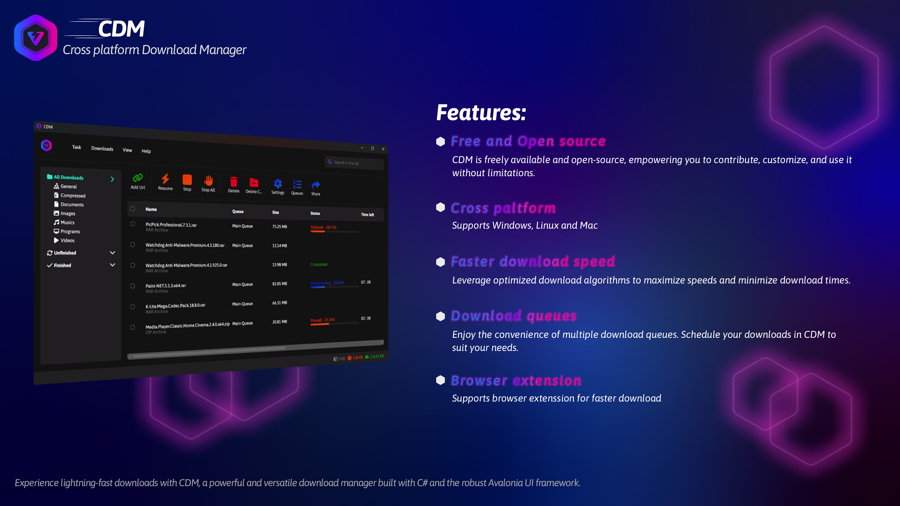
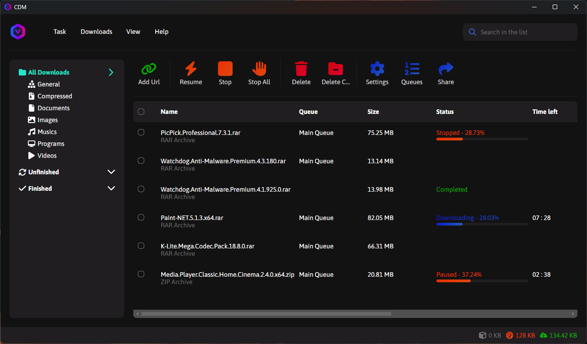
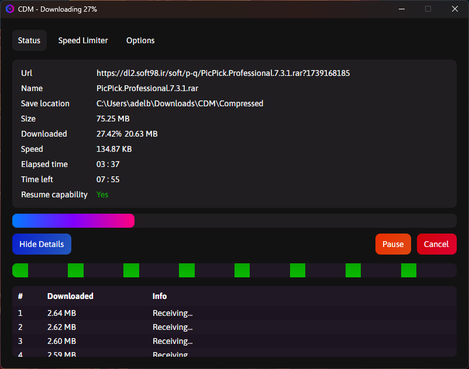
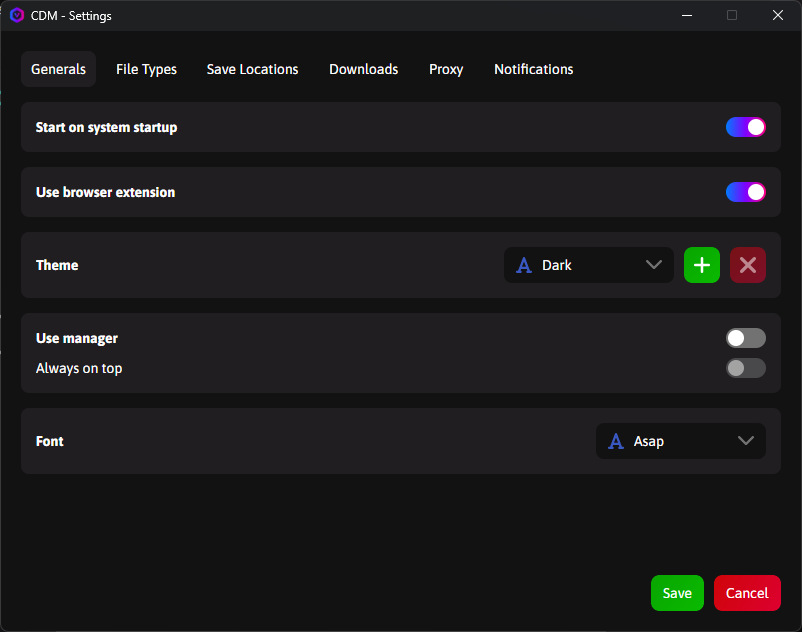

# 🌐 Cross Platform Download Manager (CDM)

---

## 🚀 Introduction

**Cross Platform Download Manager (CDM)** is a **fast, free, and open-source** tool that offers seamless download management across **Windows**, **macOS**, and **Linux**.

> _“A blazing-fast, modern download manager for everyone.”_

---

## 📸 Screenshots

| Main Interface | Download Window | Settings |
|----------------|-----------------|----------|
|  |  |  |

---

## 📥 Installation Guide

### 🔹 1. Install the Main App

1. Go to the [CDM Releases Page](https://github.com/adel-bakhshi/CrossPlatformDownloadManager/releases).
2. Download the appropriate version for your OS.
3. Extract or install the files.
4. Run the app and start downloading!

> ✅ No extra setup required.

### 🔹 2. Install the Browser Extension

> Due to embargo restrictions, CDM is not yet on Chrome Web Store. Install it manually as follows:

#### 🔸 Chromium Browsers (Chrome, Edge, Brave, etc.)

1. [Download `.crx` file](https://github.com/adel-bakhshi/cdm-browser-extension/releases)
2. Go to `chrome://extensions/`
3. Enable **Developer Mode**
4. Drag & drop the `.crx` or use **Load Unpacked** for folders

#### 🔸 Firefox

1. Visit the [Firefox Add-on Page](https://addons.mozilla.org/en-US/firefox/addon/cdm-browser-extension/)
2. Click **Add to Firefox**
3. Done!

> 🔄 Extensions are synchronized and maintained for both browsers.

---

## 🎨 Themes & Personalization

CDM lets you customize your experience:

- Switch between Light & Dark mode
- Create custom themes
- Share themes with others

👉 See the [Theme Guide](./Assets/MarkDown/THEME_GUIDE.md)

---

## ✨ Features at a Glance

- ⚙️ **Cross-Platform:** Windows, macOS, Linux
- 🚀 **High-Speed Downloads:** Multi-threaded support
- 🧩 **Browser Integration:** Chrome, Firefox, Edge, Brave, etc.
- ⏸️ **Pause & Resume**
- ⏬ **Download Queue**
- 📶 **Speed Limiting**
- 🧠 **Smart UI:** Beginner-friendly & advanced settings
- 📁 **Wide File Support:** From videos to archives
- 🎨 **Theme Customization**
- 🆓 **100% Free & Open-Source** (AGPL-3.0 License)

---

## ⚠️ Known Issues

- Stopping downloads may cause temporary slowdowns.
> We're actively investigating this issue.

Report bugs or suggest improvements [here](https://github.com/adel-bakhshi/CrossPlatformDownloadManager/issues)

---

## 💖 Support CDM

Your support helps us grow!

| Bitcoin | Ethereum | Tether |
|--------|----------|--------|
|  `bc1qx3cyervg9wrrpqtr65ew5h7a9h2dnl5n7eul9k` |  `0x6D66BdD07EBA5876f1E4E96B96237C0F272c3F27` |  `TC7CtsRLgX1aWrKL1eVKMwc9TCXyBkNheu` |

Every donation makes a real impact 🙏

---

## 🤝 Contribute

We love community contributions!

1. Fork the repo
2. `git checkout -b feature/my-feature`
3. Make changes & commit
4. `git push origin feature/my-feature`
5. Open a Pull Request 🎉

---

## 📜 License

Licensed under the [AGPL-3 License](https://github.com/adel-bakhshi/CrossPlatformDownloadManager?tab=AGPL-3.0-1-ov-file#)

---

## 📬 Contact

📧 Email: [adelbakhshi78@yahoo.com](mailto:adelbakhshi78@yahoo.com)  
📨 Telegram: [@ADdy2142](https://t.me/ADdy2142)  
🌐 GitHub: [adel-bakhshi](https://github.com/adel-bakhshi)

---

## 🙏 Acknowledgments

Thanks to all developers and contributors! Special mentions:

- 💠 [Avalonia UI](https://avaloniaui.net/)
- 🧰 [JetBrains](https://www.jetbrains.com/)
- ⬇️ [Downloader Library](https://github.com/bezzad/Downloader)

---

## 🔭 Roadmap

### 🔹 For CDM

- ✅ macOS Build Testing
- ✅ System Notifications
- ✅ Multilingual Support
- ⏳ Tray Icon Menu Fix
- ⏳ In-App Help Section

### 🔹 For Extension

- ⏳ Chrome Store Publishing
- ⏳ Batch Link Handling

Have an idea? [Let us know!](https://github.com/adel-bakhshi/CrossPlatformDownloadManager/issues)

---
